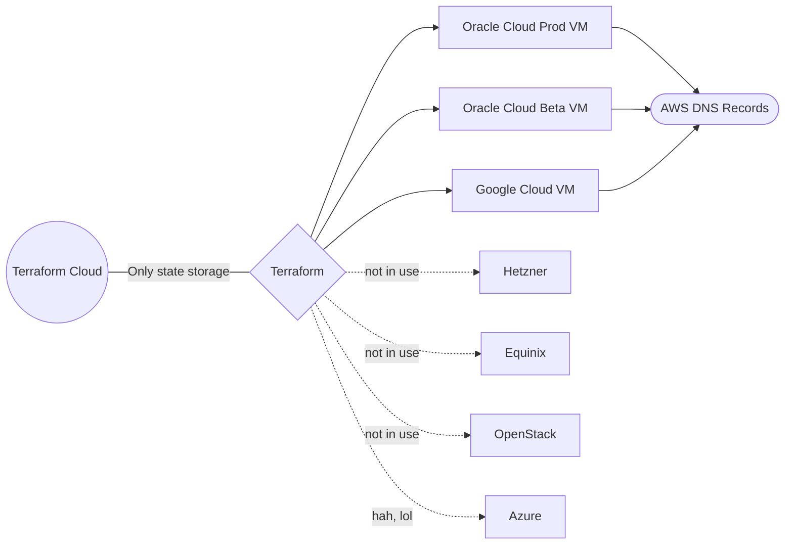

# Quickly spawn VMs for day-to-day use

requires ed25519 ssh-keys

## Landscape overview

```mermaid
flowchart LR

tf_cloud((Terraform Cloud))
tf{Terraform}
oc_prod[Oracle Cloud Prod VM]
oc_beta[Oracle Cloud Beta VM]
google[Google Cloud VM]
aws([AWS DNS Records])
hetzner[Hetzner]
equinix[Equinix]
openstack[OpenStack]
azure[Azure]

tf_cloud ---|Only state storage| tf
tf --> oc_prod
tf --> oc_beta
tf --> google
oc_prod --> aws
oc_beta --> aws
google --> aws
tf -.->|not in use| hetzner
tf -.->|not in use| equinix
tf -.->|not in use| openstack
tf -.->|hah, lol| azure
```
